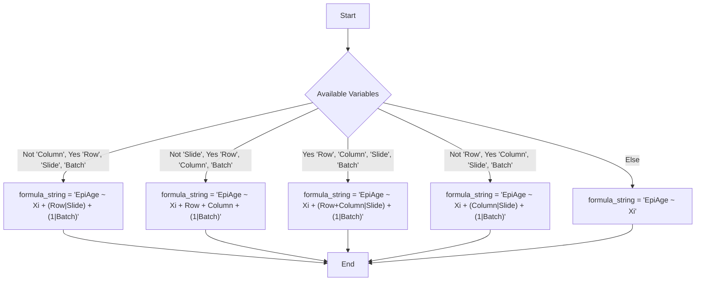

# Epigenetic Age Pipeline
 
'EpigeneticAgePipeline' is a comprehensive package designed for processing and analyzing DNA methylation data. The package provides a variety of epigenetic age measures, epigenetic age acceleration measures, residual generation, cell-count generation and provides a set of plots and tables .
 
## Installation 
 
1. Install the following packages which act as dependencies for the pipeline.
 
```
if (!require("BiocManager", quietly = TRUE))
    install.packages("BiocManager")
 
packages_to_install <- c(
    "ggplot2",
    "glmmTMB",
    "devtools",
    "magick",
    "reshape2",
    "minfi",
    "FlowSorted.CordBloodCombined.450k",
    "FlowSorted.Blood.EPIC",
    "IlluminaHumanMethylation27kanno.ilmn12.hg19",
    "IlluminaHumanMethylation450kanno.ilmn12.hg19",
    "IlluminaHumanMethylationEPICanno.ilm10b4.hg19",
    "IlluminaHumanMethylationEPICv2anno.20a1.hg38",
    "IlluminaHumanMethylationMSAanno.ilm10a1.hg38",
    "IlluminaHumanMethylationEPICv2manifest",
    "IlluminaHumanMethylationEPICmanifest",
    "IlluminaHumanMethylation450kmanifest",
    "IlluminaHumanMethylation27kmanifest",
    "IlluminaHumanMethylationMSAmanifest",
    "sesame",
    "methylclock"
)

for (package in packages_to_install) {
    if (!requireNamespace(package, quietly = TRUE)) {
        BiocManager::install(package)
    }
}

remotes::install_github('CastellaniLab/EpigeneticAgePipeline')
```
2. Once installed, the primary function of the package is used by invoking the ‘main’ function with the required parameters.     
 See ‘Usage Guidelines’ below for more details. 
```
library(EpigeneticAgePipeline)
main(directory = directory, #directory containing IDAT/beta values/supporting data
    normalize = TRUE, #should normalize beta values?
    useBeta = FALSE, #should use beta values contained within a betaValues.csv file?
    arrayType = "450K", #specification of array type used to generate idat files 
    useSampleSheet = FALSE, #should use phenotypic data found within a Sample_Sheet.csv file?
    doParallel = TRUE, #should utilize parallel processing when reading beta values?
    writeBeta = TRUE, #should write beta values from processed IDAT files
    useAdult = FALSE #should assume using adult blood samples for cell counts or cord blood?
)
```
 
## Description:
 
### Epigenetic Age and Acceleration Measures Provided: 
 
**Horvath Clock:**
 https://pubmed.ncbi.nlm.nih.gov/24138928/
- Description: Provides DNAm age. 
- CpG Sites: It uses a set of 353 CpG sites.
- Array Type: It was originally trained on Illumina 27K and 450K arrays.
- Cell Type: This clock is designed to work with a variety of tissues and cell types.

**Horvath2/skinHorvath:**
 https://www.nature.com/articles/s41576-018-0004-3
- Description: Provides DNAm age.
- CpG Sites: It uses a set of 391 CpG sites.
- Array Type: It was originally trained on Illumina 450K arrays.
- Cell Type: Primarily designed for skin/blood tissue.
 
**Hannum Clock:**
 https://www.sciencedirect.com/science/article/pii/S1097276512008933
- Description: Provides DNAm age.
- CpG Sites: It relies on a set of 71 CpG sites.
- Array Type: This clock was trained on Illumina 450K arrays.
- Cell Type: Designed primarily for blood samples.
 
**Levine/PhenoAge Clock:**
 https://www.ncbi.nlm.nih.gov/pmc/articles/PMC5940111/
- Description: Provides DNAm age.
- CpG Sites: Uses 513 CpG sites.
- Array Type: This clock was trained on Illumina 27K, 450K and EPIC array types.
- Cell Type: Designed primarily for blood samples.

**GrimAge:**
https://www.nature.com/articles/s43587-022-00248-2
- Description: Provides DNAm age.
- CpG Sites: Uses 78464 CpG sites.
- Array Type: Trained using Illumina 450K and EPIC array types.
- Cell Type: Designed primarily for blood samples.
NOTE: To generate **GrimAge**, chronological age must be included ("Age@@@1"), as well as sample sex ("Sex@@@2"). Valid values for male sex are "1", "M" or "Male". Valid values for female sex are "2", "F", or "Female".    
 
**DunedinPACE:**
 https://elifesciences.org/articles/73420
- Description: Provides the estimated rate of biological aging.
- CpG Sites: Uses 173 CpG sites.
- Array Type: Trained using Illumina 450K and EPIC array types.
- Cell Type: Designed primarily for blood samples.
 
 
### Cell Counts
 
If IDAT files are provided, methylation data can be used to determine cell counts of the following cell types .
 
 useAdult == FALSE
- B Cells
- CD4T Cells
- CD8T Cells
- Granulocytes
- Monocytes
- Nucleated Red Blood cells  

useAdult == TRUE  
- B Cells  
- CD4T Cells  
- CD8T Cells  
- Monocytes  
- Neutrophils  
- Natural Killer Cells  


 
### Introduction to Residual Generation
 
This section describes the proccess of residual generation adjusted for relevant common covariates. The function constructs a formula string for the linear model based on the presence of the variables “Row”, “Column”, “Slide”, and “Batch” in Sample_Sheet.csv, as available. If you have access to these variables in your Sample_Sheet.csv, make sure to append "@@@2" to each variable,  and be mindful of capitalization. More information on using these variables can be found in Usage Guidelines.    
 
#### Dynamic Formula Construction for Linear Models 
Based on the available data variables, the function dynamically constructs the formula for the linear model. Below are the possible formulae: 
 

 
*Note: In these formulae, `Xi` represents the independent variables.*

### Principal Component Analysis

PCA is performed on beta methylation values. By default, the first 5 are used in the linear model, but can be adjusted via the ‘PCs’ attribute (see Usage Guidelines). If a sample is +-3 SDs from the mean in one of the used PC’s, it is deemed to be an outlier. 
 
#### Implementation of the Linear Model Generation
 
Once the formula is constructed, the linear model is generated using the Gaussian method. The function glmmTMB from the glmmTMB package is used to fit the model. The maximum number of iterations and evaluations for the optimizer are set to 10000 to ensure convergence. The user can specify to remove highly correlated explanatory variables (greater than 0.6) during runtime.
 
## Usage Guidelines 
### Using the main Function
```
main(directory = getwd(), 
normalize = TRUE,
useBeta = FALSE,
arrayType = "450K",
useSampleSheet = TRUE,
doParallel = TRUE,
writeBeta = TRUE)
```
**directory** argument:  
String. Directory containing input data files (default: current working directory).
 
**normalize** argument:  
Logical. Perform normalization of beta values if TRUE.
 
**useBeta** argument:  
Logical. If TRUE, will expect a betaValues.csv file containing beta values (scaled between 0 and 1). If FALSE, process raw intensity data (IDAT).
 
**arrayType** argument:  
Type of DNA methylation array used (options: "27K", "450K", "EPIC", "EPICv2"
or "MSA").
 
**useSampleSheet** argument:  
Logical. If TRUE, will expect a Sample_Sheet.csv containing phenotypic data.

**doParallel** argument:  
Logical. If TRUE use parallel processing in .csv file reads.

**writeBeta** argument:
Logical. If TRUE write extracted beta values from processed IDAT files.  

**useAdult** argument:  
Logical. If TRUE asssume adult blood sample during cell count generation, else
assuming cord blood.
 
#### Output  
 
**output.txt:**  
A .txt file containing epigenetic age/acceleration estimates, covariate data and residual data.
 
**matrixplot{Clockname}.pdf:**  
A set of .pdf files illustrating the correaltions between a specific epigenetic age estimate and covariates.
 
**epigeneticAge.txt:**  
A .txt file showing epigenetic age/acceleration estimates. This file is better suited for importing into a spreadsheet program than output.txt.
 
**plot{Clockname}.pdf:**  
A set of .png files showing a line plot of an epigenetic age estimate against chronological age.
 
**SampleIDandAge.png:**  
A .png file containing a grouped bar chart showing each sample and their associated epigenetic age estimates as well as chronological age. Note that this file is typically a more useful analysis tool when using 
smaller sample sizes.

**{Clockname}SampleData.csv**  
.csv file containing covariate data, including clock data.
 
### Using the generateResiduals function
```
generateResiduals(directory = getwd(),
useBeta = FALSE,
formula = NULL,
arrayType = "450K",
ignoreCor = FALSE,
PCs = 5,
threshold = 3,
doParallel = TRUE,
doCellCounts = TRUE,
useAdult = FALSE)

``` 
**directory** argument:  
Directory containing input data files (default: current working directory). 
 
**useBeta** argument:  
Logical. If TRUE, will expect a betaValues.csv file containing beta values (scaled between 0 and 1). If FALSE, process raw intensity data (IDAT).  

**formula** argument:  
String. If the user wants to use a custom formula, one may input it as a string.
If using PC's, input in the format of "PC1".  
Adult blood cell names: "Bcell", "CD4T", "CD8T", "Mono", "Neu", "NK"  
Cord blood cell names: "Bcell", "CD4T", "CD8T", "Gran", "Mono", "nRBC", "NK"  
Example:  
"myAge ~ Age + BMI + Smoking_Status + PC1"  
 
**arrayType** argument:  
Type of DNA methylation array used (options: "27K", "450K", "EPIC", "EPICv2" or "MSA").  

**ignoreCor** argument:
Logical. If TRUE then removing highly correlated (>=0.6) covariates will not be an
option, default FALSE.

**PCs** argument:
Numerical. Number of PC's to generate. Default is 5.

**threshold** argument:
Numerical. Threshold for MAD outlier detection. Default is 3.
median +- threshold * MAD

**doParallel** argument:
Logical. Use parallel processing if reading beta values. Default is TRUE.  

**doCellCounts** argument:  
Logical. If TRUE include cell counts for analysis.  

**useAdult** argument:  
Logical. If TRUE asssume adult blood sample during cell count generation, else
assuming cord blood.  
 
#### Output  
 
**Residuals.csv:**  
A .csv file containing residuals from the linear model.

**EpiAgeSampleData.csv**  
.csv file containing covariate data, including clock data.

**matrixplotEpiAge.pdf:**  
.pdf file illustrating the correaltions between specific epigenetic age estimate and covariates.

**Outliers.csv**  
A .csv file containing samples that were deemed to be outliers
during PCA.
 
### Description of Client-Side Input Files
**Sample_Sheet.csv**  
.csv file containing phenotypic data for each sample.
*Guidlines listed below
 
**IDAT Files**  
Raw IDAT files containing unprocessed methylation data for each sample.
 
**betaValues.csv**  
If IDAT files are not available, processed beta values can be provided. The **first colulmn** should contain CpG names. The rest of the columns should contain sample names.
 
### Guidelines for Sample_Sheet.csv 
**To format a variable in Sample_Sheet.csv:**  
If a variable contains **numeric** type data, append "@@@1" to the column name  
 
If a variable contains **factor** type data, append "@@@2" to the column name.  
 
Ex. variable "isSmoker" would become "isSmoker@@@2".  
 
To generate **GrimAge**, chronological age must be included ("Age@@@1"), as well as sample sex ("Sex@@@2"). Valid values for male sex are "1", "M" or "Male". Valid values for female sex are "2", "F", or "Female".    
 
If using the **generateResiduals** function, name the column with epigenetic age values "EpiAge@@@1".  
 
If you want to use random effects in the **generateResiduals** function, view the guidelines found in "Introduction to Residual Generation" above.  
 
**Specification for Using 'Array' Variable**  
If using an Array variable to store row and column information, please make sure it follows the format "RXCY" (X: row number, Y: column number).  
Make sure to append @@@2 to the column name  
 
 
### Common Errors
1. If using the package on a computing server, and you are getting errors such as:  
```
Error in ExperimentHub::ExperimentHub() :
  DEFUNCT: As of ExperimentHub (>1.17.2), default caching location has changed.
  Problematic cache: /users/ccastell/.cache/ExperimentHub
  See https://bioconductor.org/packages/devel/bioc/vignettes/ExperimentHub/inst/doc/ExperimentHub.html#default-caching-location-update
```
Try running:
```
library(ExperimentHub)
oldcache = path.expand(rappdirs::user_cache_dir(appname="ExperimentHub"))
setExperimentHubOption("CACHE", oldcache)
eh = ExperimentHub(localHub=TRUE)
 
## removes old location and all resources
removeCache(eh, ask=FALSE)
 
## create the new default caching location
newcache = tools::R_user_dir("ExperimentHub", which="cache")
setExperimentHubOption("CACHE", newcache)
eh = ExperimentHub()
```

