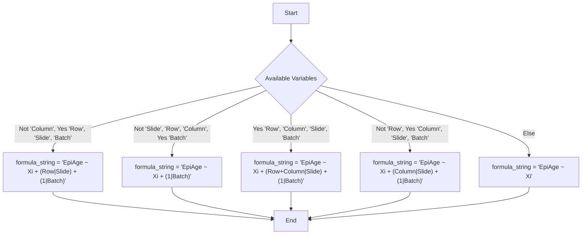

# Epigenetic Age Pipeline
 
'EpigeneticAgePipeline' is a comprehensive package designed for processing and analyzing DNA methylation data. The package provides a variety of epigenetic age measures, epigenetic age acceleration measures, residual generation, cell-count generation and provides a set of plots and tables .
 
## Installation 
 
1. Install the following packages which act as dependencies for the pipeline.
 
```
if (!require("BiocManager", quietly = TRUE)) {
	install.packages("BiocManager")
}


# Full Install
packages_to_install <- c(
    "ggplot2",
    "glmmTMB",
    "ggpubr",
    "devtools",
    "magick",
    "reshape2",
    "minfi",
    "FlowSorted.CordBlood.450k",
    "FlowSorted.CordBloodCombined.450k",
    "FlowSorted.Blood.EPIC",
	"BeadSorted.Saliva.EPIC",
	"FlowSorted.DLPFC.450k",
    "IlluminaHumanMethylation27kanno.ilmn12.hg19",
    "IlluminaHumanMethylation450kanno.ilmn12.hg19",
    "IlluminaHumanMethylationEPICanno.ilm10b4.hg19",
    "IlluminaHumanMethylationEPICv2anno.20a1.hg38",
    "IlluminaHumanMethylationMSAanno.ilm10a1.hg38",
    "IlluminaHumanMethylationEPICv2manifest",
    "IlluminaHumanMethylationEPICmanifest",
    "IlluminaHumanMethylation450kmanifest",
    "IlluminaHumanMethylation27kmanifest",
    "IlluminaHumanMethylationMSAmanifest",
	"planet",
    "sesame",
    "methylclock",
	"ExperimentHub",
	"EpiDISH"
)

# If only using extracted beta values
packages_to_install <- c(
    "ggplot2",
    "glmmTMB",
    "ggpubr",
    "devtools",
    "magick",
    "reshape2",
    "minfi",
	"FlowSorted.Blood.EPIC",
	"FlowSorted.Blood.450k",
	"FlowSorted.CordBloodCombined.450k",
	"FlowSorted.DLPFC.450k",
    "sesame",
    "methylclock"
	"ExperimentHub",
	"EpiDISH"
)

# For 27K Only
packages_to_install <- c(
    "ggplot2",
    "glmmTMB",
    "ggpubr",
    "devtools",
    "magick",
    "reshape2",
    "minfi",
	"FlowSorted.Blood.EPIC",
	"FlowSorted.Blood.450k",
	"FlowSorted.CordBloodCombined.450k",
	"FlowSorted.DLPFC.450k",
    "IlluminaHumanMethylation27kanno.ilmn12.hg19",
    "IlluminaHumanMethylation27kmanifest",
    "sesame",
    "methylclock"
	"ExperimentHub",
	"EpiDISH"
)

# For 450K Only
packages_to_install <- c(
    "ggplot2",
    "glmmTMB",
    "ggpubr",
    "devtools",
    "magick",
    "reshape2",
    "minfi",
	"FlowSorted.Blood.EPIC",
	"FlowSorted.Blood.450k",
	"FlowSorted.CordBloodCombined.450k",
	"FlowSorted.DLPFC.450k",
    "IlluminaHumanMethylation450kanno.ilmn12.hg19",
    "IlluminaHumanMethylation450kmanifest",
    "sesame",
    "methylclock",
	"ExperimentHub",
	"EpiDISH"
)

# For EPICv1 Only
packages_to_install <- c(
    "ggplot2",
    "glmmTMB",
    "ggpubr",
    "devtools",
    "magick",
    "reshape2",
    "minfi",
	"FlowSorted.Blood.EPIC",
	"FlowSorted.Blood.450k",
	"FlowSorted.CordBloodCombined.450k",
	"FlowSorted.DLPFC.450k",
    "IlluminaHumanMethylationEPICanno.ilm10b4.hg19",
    "IlluminaHumanMethylationEPICmanifest",
    "sesame",
    "methylclock",
	"ExperimentHub",
	"EpiDISH"
)

# For EPICv2 Only
packages_to_install <- c(
    "ggplot2",
    "glmmTMB",
    "ggpubr",
    "devtools",
    "magick",
    "reshape2",
    "minfi",
	"FlowSorted.Blood.EPIC",
	"FlowSorted.CordBloodCombined.450k",
	"FlowSorted.DLPFC.450k",
	"FlowSorted.Blood.450k",
    "IlluminaHumanMethylationEPICv2anno.20a1.hg38",
    "IlluminaHumanMethylationEPICv2manifest",
    "sesame",
    "methylclock",
	"ExperimentHub",
	"EpiDISH"
)

# For MSA Only
packages_to_install <- c(
    "ggplot2",
    "glmmTMB",
    "ggpubr",
    "devtools",
    "magick",
    "reshape2",
    "minfi",
	"FlowSorted.Blood.EPIC",
	"FlowSorted.Blood.450k",
	"FlowSorted.CordBloodCombined.450k",
	"FlowSorted.DLPFC.450k",
    "IlluminaHumanMethylationMSAanno.ilm10a1.hg38",
    "IlluminaHumanMethylationMSAmanifest",
    "sesame",
    "methylclock",
	"ExperimentHub",
	"EpiDISH"
)


for (package in packages_to_install) {
    if (!requireNamespace(package, quietly = TRUE)) {
        BiocManager::install(package)
    }
}

remotes::install_github('CastellaniLab/EpigeneticAgePipeline')
```
2. Once installed, the primary function of the package is used by invoking the ‘main’ function with the required parameters.     
 See ‘Usage Guidelines’ below for more details. 
```
library(EpigeneticAgePipeline)
main(
  inputDirectory = getwd(),
  outputDirectory = getwd(),
  normalize = TRUE,
  useBeta = FALSE,
  arrayType = "EPICv2",
  useSampleSheet = TRUE,
  sampleSheetFile = "Sample_Sheet.csv",
  columnTypes = c(
    "Age" = 2,         # numeric
    "Sex" = 1,         # factor (1/2 or Male/Female)
    "Batch" = 1,       # factor
    "BMI" = 2,         # numeric
    "Array" = 1        # factor; derives Row/Column from "RXCY"
  ),
  doParallel = TRUE,
  writeBeta = TRUE,
  tissue = "bloodCord",            # "bloodAdult","bloodCord","saliva","placenta","brainDLPFC", "buccal"
  cellDeconvMethod = "RPC",        # "CP" or "RPC"
  placentaTrimester = "third",     # "first" or "third" (when tissue = "placenta")
  useImputation = FALSE
)
```
 
## Description:
 
### Epigenetic Age and Acceleration Measures Provided: 
 
**Horvath Clock (CpG and PC Version):**  
https://pubmed.ncbi.nlm.nih.gov/24138928/  
- **Description:** One of the first and still widely used “gold standard” DNAm age estimators with broad cross-tissue applicability.  
- **CpG Sites:** 353  
- **Arrays:** 27K, 450K  
- **Tissues:** Multi-tissue (broadly applicable)

**Horvath2 / Skin & Blood (CpG and PC Version):**  
https://www.nature.com/articles/s41576-018-0004-3  
- **Description:** Refined for improved performance in skin and blood; validated on saliva, fibroblasts, keratinocytes, buccal, endothelial, and lymphoblastoid cells.  
- **CpG Sites:** 391  
- **Arrays:** 450K  
- **Tissues:** Skin/blood (primary), broader coverage as noted

**Hannum Clock (CpG and PC Version):**  
https://www.sciencedirect.com/science/article/pii/S1097276512008933  
- **Description:** Early blood-focused epigenetic clock; strong predictor of age and age-related conditions in blood.  
- **CpG Sites:** 71  
- **Arrays:** 450K  
- **Tissues:** Blood (primary)

**Levine / PhenoAge (CpG and PC Version):**  
https://www.ncbi.nlm.nih.gov/pmc/articles/PMC5940111/  
- **Description:** DNAm age proxy optimized to predict phenotypic aging outcomes; often outperforms earlier clocks on morbidity/mortality associations.  
- **CpG Sites:** 513  
- **Arrays:** 27K, 450K, EPIC  
- **Tissues:** Blood (primary)

**GrimAge (v1, v2, PC):**  
https://www.aging-us.com/article/101684/text
https://www.aging-us.com/article/204434/text
- **Description:** Mortality-oriented DNAm age derived from DNAm surrogates (e.g., PACKYRS and protein surrogates). v2 adds two DNAm surrogate components relative to v1. Known for high mortality hazard ratio prediction.  
- **CpG Sites:** ~1,030 (v1 baseline; v2 extends via two additional surrogates)  
- **Arrays:** 450K, EPIC  
- **Tissues:** Blood (primary)  
- **NOTE:** To compute GrimAge, include chronological age (`"Age" = 2`) and sex (`"Sex" = 1`). Valid sex values: `"1"` or `"Male"`; `"2"` or `"Female"`.

**DunedinPACE:**  
https://elifesciences.org/articles/73420  
- **Description:** Pace-of-aging estimator rather than a chronological age; quantile-normalized to internal reference means in this pipeline.  
- **CpG Sites:** 173  
- **Arrays:** 450K, EPIC  
- **Tissues:** Blood (primary)

**PedBE:**  
https://www.pnas.org/doi/full/10.1073/pnas.1820843116  
- **Description:** Pediatric clock trained primarily on buccal epithelial samples; suited for children/adolescents and developmental timing studies.  
- **CpG Sites:** 94  
- **Arrays:** 450K, EPIC  
- **Tissues:** Pediatric buccal (primary)

**Wu:**  
https://www.aging-us.com/article/102399/text  
- **Description:** Pediatric blood clock offering high accuracy in children; used for developmental/clinical pediatric contexts.  
- **CpG Sites:** 111  
- **Arrays:** 27K, 450K  
- **Tissues:** Pediatric blood (primary)

**TL:**  
https://www.aging-us.com/article/102173/text  
- **Description:** DNAm estimator of leukocyte telomere length; captures age-related shortening and relates to aging morbidities.  
- **CpG Sites:** 140  
- **Arrays:** 450K, EPIC  
- **Tissues:** Blood (primary)

**BLUP:**  
https://genomemedicine.biomedcentral.com/articles/10.1186/s13073-019-0667-1  
- **Description:** Best Linear Unbiased Prediction model leveraging genome-wide CpGs for high-precision, robust cross-cohort/tissue performance.  
- **CpG Sites:** 319,607  
- **Arrays:** 450K, EPIC  
- **Tissues:** Blood and saliva (training sets)

**EN:**  
https://genomemedicine.biomedcentral.com/articles/10.1186/s13073-019-0667-1  
- **Description:** Sparse, portable predictor trained on the same blood/saliva datasets as BLUP; strong cross-platform accuracy and generalization.  
- **CpG Sites:** 514  
- **Arrays:** 450K, EPIC  
- **Tissues:** Blood and saliva (training sets)

#### Acceleration  
For all clocks except DunedinPACE, if age is provided as a covariate, 3 types of age acceleration is provided:
- `ageAcc` -> Epigenetic Age - Chronological age  
- `ageAcc2` -> Residuals of Epigenetic Age ~ Chronological age + Cell Proportions  
- `ageAcc3` -> Residuals of Epigenetic Age ~ Chronological age  

#### Quality Control & Filtering 
- **Low intensity:** Drops samples with mean(`mMed`,`uMed`) < **10.5** (minfi::getQC).
- **Detection p-values:** Drops samples with mean detP ≥ **0.05**; drops probes failing in any sample at **p ≥ 0.01**.
- **Bead count:** Drops samples/probes with bead count < **3** beyond 0.05 fraction.
- **SNP removal:** `minfi::dropLociWithSnps`.
- **Cross-reactive probes:** Array-aware lists (27K/450K/EPIC/EPICv2/MSA).
- **Sex chromosomes:** Removes chrX/chrY probes by selected array annotation.
- **EPICv2/MSA:** Collapses to legacy IDs via **sesame::betasCollapseToPfx**.
- **Removal reports (.csv):** When bead-count filtering drops samples, a **`failedSamples_beadcount.csv`** file is written to the output directory with sample IDs and their low-bead fractions; 
	other filtering steps print dropped counts/names to the console.
 
 
### Cell Counts
- `tissue=` **bloodAdult**, **bloodCord**, **saliva**, **placenta**, **brainDLPFC**, **buccal**
- `cellDeconvMethod=` **"CP"** (constrained projection via FlowSorted.Blood.EPIC) or **"RPC"** (EpiDISH)

**References used automatically**
- Adult blood: *FlowSorted.Blood.450k*
- Cord blood: *FlowSorted.CordBloodCombined.450k*
- Saliva: *BeadSorted.Saliva.EPIC* (via ExperimentHub)
- Placenta: *plaNET* first/third trimester means (`placentaTrimester`)
- DLPFC: averages from *FlowSorted.DLPFC.450k* (computed internally)
- Buccal: Epi/Fib/Immune via *centEpiFibIC.m*, then immune subtypes via *cent12CT.m (EPIC)* or *cent12CT450k.m (450K)*


### Introduction to Residual Generation
 
This section describes the proccess of residual generation adjusted for relevant common covariates. The function constructs a formula string for the linear model based on the presence of the variables “Row”, “Column”, “Slide”, and “Batch” in Sample_Sheet.csv, as available. If you have access to these variables in your Sample_Sheet.csv, make sure to append "@@@2" to each variable,  and be mindful of capitalization. More information on using these variables can be found in Usage Guidelines.    
 
#### Dynamic Formula Construction for Linear Models 
Based on the available data variables, the function dynamically constructs the formula for the linear model. Below are the possible formulae: 
 

 
*Note: In these formulae, `Xi` represents the independent variables.*

### Principal Component Analysis

PCA is performed on beta methylation values. By default, the first 5 are used in the linear model, but can be adjusted via the ‘PCs’ attribute (see Usage Guidelines). If a sample is +-3 SDs from the mean in one of the used PC’s, it is deemed to be an outlier. 
 
#### Implementation of the Linear Model Generation
 
Once the formula is constructed, the linear model is generated using the Gaussian method. The function glmmTMB from the glmmTMB package is used to fit the model. The maximum number of iterations and evaluations for the optimizer are set to 10000 to ensure convergence. The user can specify to remove highly correlated explanatory variables (greater than 0.6) during runtime.
 
## Usage Guidelines 
### Using the main Function
```
main(
  inputDirectory = getwd(),
  outputDirectory = getwd(),
  normalize = TRUE,
  useBeta = FALSE,
  arrayType = "EPICv2",
  useSampleSheet = TRUE,
  sampleSheetFile = "Sample_Sheet.csv",
  columnTypes = NULL,
  doParallel = TRUE,
  writeBeta = TRUE,
  tissue = "bloodCord",     
  cellDeconvMethod = "RPC",       
  placentaTrimester = "third",     
  useImputation = FALSE,
  detPSampleCutoff = 0.05,
  detPProbeCutoff = 0.01,
  minBeads = 3,
  beadSampleMaxFailFrac = 0.05,
  beadProbeMaxFailFrac  = 0.05
)
```
**`inputDirectory`** *(string)*  
  Directory containing input data files. **Default:** `getwd()`.

**`outputDirectory`** *(string)*  
  Directory where outputs are written. **Default:** `inputDirectory`.

**`normalize`** *(logical)*  
  Apply Horvath-style normalization (via `methylclock`) when computing CpG-based clocks. **Default:** `TRUE`.

**`useBeta`** *(logical)*  
  If `TRUE`, load precomputed beta values from `betaValues.csv`/`.csv.gz` (first column = CpG IDs, remaining columns = samples). If `FALSE`, process raw IDATs. **Default:** `FALSE`.

**`arrayType`** *(string)*  
  DNA methylation array platform: `"27K"`, `"450K"`, `"EPIC"`, `"EPICv2"`, or `"MSA"`. **Default:** `"450K"` (if not otherwise specified in your doc).

**`useSampleSheet`** *(logical)*  
  Expect a `Sample_Sheet.csv` with phenotypic/covariate data. **Default:** `TRUE`.

**`sampleSheetFile`** *(string)*  
  File name for the sample sheet. **Default:** `"Sample_Sheet.csv"`.

**`columnTypes`** *(named integer vector | `NULL`)*  
  Declares sample-sheet column types: `1 = factor`, `2 = numeric`.  
  Example: `c("Age"=2,"Sex"=1,"Batch"=1,"BMI"=2,"Array"=1)`  
  If `"Array"` (format `RXCY`) is present, `Row` and `Column` are auto-derived. **Default:** `NULL` (required when `useSampleSheet=TRUE`).

**`doParallel`** *(logical)*  
  Use parallelized CSV reading for large `betaValues.csv`. **Default:** `TRUE`.

**`writeBeta`** *(logical)*  
  Write extracted beta values (`extractedBetaValues.csv`) after IDAT processing. **Default:** `TRUE`.

**`tissue`** *(string)*  
  Reference panel for cell deconvolution: `"bloodAdult"`, `"bloodCord"`, `"saliva"`, `"placenta"`, `"brainDLPFC"` or `"buccal"`. **Default:** `"bloodAdult"`

**`cellDeconvMethod`** *(string)*  
  Cell proportion estimation method: `"CP"` (constrained projection) or `"RPC"` (robust partial correlations via EpiDISH). **Default:** `"CP"`.

**`placentaTrimester`** *(string)*  
  When `tissue = "placenta"`, choose `"first"` or `"third"` trimester reference. **Default:** `"third"`.

**`useImputation`** *(logical)*  
  If `TRUE`, perform mean-imputation of missing CpGs (from GSE40279) for PC clocks and DunedinPACE using packaged reference means.  

**detPSampleCutoff** *(numeric 0–1)*  
  Sample-level detection-p filter. For each sample, compute mean detection-p across probes; samples with mean detection-p ≥ this cutoff are removed. **Default:** `0.05`.

**detPProbeCutoff** *(numeric 0–1)*  
  Probe-level detection-p filter. After sample filtering, retain a probe only if detection-p is < this cutoff in all remaining samples; otherwise drop the probe. **Default:** `0.01`.

**minBeads** *(integer ≥ 0)*  
  Minimum bead count for a probe–sample measurement to be considered reliable. Observations with bead count < `minBeads` are marked low-bead for downstream fraction tests. **Default:** `3`.

**beadSampleMaxFailFrac** *(numeric 0–1)*  
  Max fraction of low-bead observations permitted per sample. Samples with a higher fraction are removed. **Default:** `0.05`.

**beadProbeMaxFailFrac** *(numeric 0–1)*  
  Max fraction of low-bead observations permitted per probe across the (post-filtered) samples. Probes with a higher fraction are removed. **Default:** `0.05`.
 
#### Output  

**output.txt**  
Plain-text summary of covariate–clock correlations compiled across all processed age measures (e.g., Horvath, Hannum, PhenoAge, GrimAge variants, PC clocks). 

**epigeneticAge.txt**  
Tab-delimited table of epigenetic clock estimates per sample.

**results.md**  
Markdown table summarizing the same epigenetic age results for human-readable review.

**extractedBetaValues.csv** *(conditional)*  
Written **only if** `useBeta = FALSE` **and** `writeBeta = TRUE`; contains beta values extracted from IDAT processing.

**GroupedAge.png**  
Grouped bar chart of each sample’s age measures (clocks) and, when present, chronological age.

**matrixplot{ClockName}.png**  
Correlation matrix image for each processed age measure vs. available covariates (e.g., `matrixplotHorvath.png`).

**plot_{ClockName}.png** *(one per clock when `Age` available)*  
Scatter plots of DNAm age vs. chronological age with regression line and Pearson correlation (e.g., `plot_GrimAge_V2.png`).

**{ClockName}SampleData.csv**  
Per-clock CSV of the covariate frame used for correlation/plotting, including the specific clock column (e.g., `Horvath_PCSampleData.csv`).

**EpiAgeResultsDf** *(R object in `.GlobalEnv`)*  
Data frame of numeric results (clocks and accelerations when computed) assigned to `.GlobalEnv` for immediate use.

**CellCountsDf** *(R object in `.GlobalEnv`, if applicable)*  
Cell composition estimates (when IDATs and cell deconvolution are performed) assigned to `.GlobalEnv`.

**myEnv** *(R environment)*  
Working environment that retains intermediate and final objects (e.g., `bVals`, `pdataSVs`, `exportDf`) for programmatic access.
This also includes a dataframe summarizing CpG clock coverage. 


 
### Using the generateResiduals function
```
generateResiduals(
  inputDirectory = getwd(),
  outputDirectory = getwd(),
  sampleSheetFile = "Sample_Sheet.csv"
  columnTypes = NULL, 			   
  useBeta = FALSE,
  formula = NULL,                 
  arrayType = "450K",
  ignoreCor = FALSE,
  PCs = 5,
  threshold = 3,
  doParallel = TRUE,
  doCellCounts = TRUE,
  tissue = "bloodAdult",
  cellDeconvMethod = "CP",
  placentaTrimester = "third",
  detPSampleCutoff = 0.05,
  detPProbeCutoff = 0.01,
  minBeads = 3,
  beadSampleMaxFailFrac = 0.05,
  beadProbeMaxFailFrac  = 0.05
)
``` 
**`inputDirectory`** *(string)*  
  Directory containing input data files. **Default:** `getwd()`.

**`outputDirectory`** *(string)*  
  Directory where outputs are written. **Default:** `inputDirectory`.

**`sampleSheetFile`** *(string)*  
  File name of the sample sheet. **Default:** `"Sample_Sheet.csv"`.

**`columnTypes`** *(named integer vector | `NULL`)*  
  **Required.** Declares sample-sheet column types: `1 = factor`, `2 = numeric`.  
  Example: `c("EpiAge"=2,"Age"=2,"Sex"=1,"Batch"=1,"Array"=1)`.  
  If `"Array"` is present in `RXCY` format, `Row` and `Column` are derived automatically.

**`useBeta`** *(logical)*  
  If `TRUE`, load precomputed beta values from `betaValues.csv`/`.csv.gz` (first column = CpG IDs, remaining columns = samples).  
  If `FALSE`, process raw IDATs. **Default:** `FALSE`.

**`formula`** *(string | `NULL`)*  
  Custom model formula string (e.g., `"EpiAge ~ Age + BMI + Smoking_Status + PC1"`).  
  PCs are referenced as `"PC1"`, `"PC2"`, …; 
  adult cell names: `Bcell, CD4T, CD8T, Mono, Neu, NK`;  
  cord blood cells: `Bcell, CD4T, CD8T, Gran, Mono, nRBC, NK`; 
  placenta: `Trophoblasts, Stromal, Hofbauer, Endothelial, nRBC, Syncytiotrophoblast`;  
  saliva: `Epithelial, Immune`;
  frontal cortex: `NeuN_neg, NeuN_pos`;
  **Default:** `NULL` (auto formula based on available covariates).

**`arrayType`** *(string)*  
  DNA methylation array platform: `"27K"`, `"450K"`, `"EPIC"`, `"EPICv2"`, or `"MSA"`. **Default:** `"450K"`.

**`ignoreCor`** *(logical)*  
  If `TRUE`, **skip** pruning of highly correlated covariates (|r| ≥ 0.6).  
  If `FALSE`, you’ll be prompted to remove them. **Default:** `TRUE`.

**`PCs`** *(integer)*  
  Number of principal components to compute and include. **Default:** `5`.

**`threshold`** *(numeric)*  
  MAD-based outlier threshold for PCs; flags samples outside `median ± threshold × MAD`. **Default:** `3`.

**`doParallel`** *(logical)*  
  Use parallelized CSV reading for large `betaValues.csv`. **Default:** `TRUE`.

**`doCellCounts`** *(logical)*  
  If `TRUE`, include reference-based cell count estimates in the model. **Default:** `TRUE`.

**`tissue`** *(string)*  
  Reference panel for cell deconvolution: `"bloodAdult"`, `"bloodCord"`, `"saliva"`, `"placenta"`, `"brainDLPFC"` or `"buccal"`. **Default:** `"bloodAdult"`

**`cellDeconvMethod`** *(string)*  
  Cell proportion method: `"CP"` (constrained projection) or `"RPC"` (robust partial correlations via EpiDISH). **Default:** `"CP"`.

**`placentaTrimester`** *(string)*  
  When `tissue = "placenta"`, choose `"first"` or `"third"` trimester reference. **Default:** `"third"`.

**detPSampleCutoff** *(numeric 0–1)*  
  Sample-level detection-p filter. For each sample, compute mean detection-p across probes; samples with mean detection-p ≥ this cutoff are removed. **Default:** `0.05`.

**detPProbeCutoff** *(numeric 0–1)*  
  Probe-level detection-p filter. After sample filtering, retain a probe only if detection-p is < this cutoff in all remaining samples; otherwise drop the probe. **Default:** `0.01`.

**minBeads** *(integer ≥ 0)*  
  Minimum bead count for a probe–sample measurement to be considered reliable. Observations with bead count < `minBeads` are marked low-bead for downstream fraction tests. **Default:** `3`.

**beadSampleMaxFailFrac** *(numeric 0–1)*  
  Max fraction of low-bead observations permitted per sample. Samples with a higher fraction are removed. **Default:** `0.05`.

**beadProbeMaxFailFrac** *(numeric 0–1)*  
  Max fraction of low-bead observations permitted per probe across the (post-filtered) samples. Probes with a higher fraction are removed. **Default:** `0.05`.
 
#### Output  

**Residuals.csv**  
Residuals from the fitted (G)LMM regressing the chosen age measure (e.g., `EpiAge`) on covariates/PCs/cell counts.

**OutlierSamples.csv**  
Samples flagged as outliers via MAD-based detection across selected principal components.

**{AgeType}SampleData.csv**  
Covariate frame used for modeling, including the target age measure (e.g., `EpiAge`), selected PCs, and (if enabled) cell counts.  

**matrixplot{AgeType}.png**  
Correlation matrix plot of `{AgeType}` versus available covariates with pairwise panels and regression overlays.  
*Example:* `matrixplotEpiAge.png`.

**CellCountsDf** *(R object in `.GlobalEnv`, if applicable)*  
Reference-based cell composition estimates when `doCellCounts = TRUE` and IDATs are processed.

**myEnv** *(R environment)*  
Holds intermediate objects used by the pipeline (e.g., `bVals`, `pdataSVs`, `outliersCSV`, `residualsCSV`) for programmatic access.

 
### Description of Client-Side Input Files
**Sample_Sheet.csv**  
.csv file containing phenotypic data for each sample.
*Guidlines listed below
 
**IDAT Files**  
Raw IDAT files containing unprocessed methylation data for each sample.
 
**betaValues.csv** or **betaValues.csv.gz**  
If IDAT files are not available, processed beta values can be provided. The **first colulmn** should contain CpG names. The rest of the columns should contain sample names.
Package will preferentially load the .gz version.
 
### Guidelines for `Sample_Sheet.csv`

This pipeline uses an explicit **`columnTypes`** mapping to declare variable types.

#### Define types in code
Provide a **named integer vector** when calling `main()` or `generateResiduals()`:

```r
columnTypes <- c(
  "Age"   = 2,  # numeric
  "Sex"   = 1,  # factor (accepts 1/2 or Male/Female)
  "Batch" = 1,  # factor
  "BMI"   = 2,  # numeric
  "Array" = 1   # factor; auto-derives Row/Column from "RXCY"
)
 
 
### Common Errors
1. If using the package on a computing server, and you are getting errors such as:  
```
Error in ExperimentHub::ExperimentHub() :
  DEFUNCT: As of ExperimentHub (>1.17.2), default caching location has changed.
  Problematic cache: /users/ccastell/.cache/ExperimentHub
  See https://bioconductor.org/packages/devel/bioc/vignettes/ExperimentHub/inst/doc/ExperimentHub.html#default-caching-location-update
```
Try running:
```
library(ExperimentHub)
oldcache = path.expand(rappdirs::user_cache_dir(appname="ExperimentHub"))
setExperimentHubOption("CACHE", oldcache)
eh = ExperimentHub(localHub=TRUE)
 
## removes old location and all resources
removeCache(eh, ask=FALSE)
 
## create the new default caching location
newcache = tools::R_user_dir("ExperimentHub", which="cache")
setExperimentHubOption("CACHE", newcache)
eh = ExperimentHub()
```


### Package References  

Aryee MJ, Jaffe AE, Corrada-Bravo H, Ladd-Acosta C, Feinberg AP, Hansen KD, Irizarry RA (2014). “Minfi: A flexible and
  comprehensive Bioconductor package for the analysis of Infinium DNA Methylation microarrays.” _Bioinformatics_,
  *30*(10), 1363-1369. doi:10.1093/bioinformatics/btu049 <https://doi.org/10.1093/bioinformatics/btu049>.

Triche TJ, Weisenberger DJ, Van Den Berg D, Laird PW, Siegmund KD (2013). “Low-level processing of Illumina Infinium DNA
  Methylation BeadArrays.” _Nucleic Acids Research_, *41*(7), e90. doi:10.1093/nar/gkt090
  <https://doi.org/10.1093/nar/gkt090>.

Fortin J, Triche TJ, Hansen KD (2017). “Preprocessing, normalization and integration of the Illumina
  HumanMethylationEPIC array with minfi.” _Bioinformatics_, *33*(4). doi:10.1093/bioinformatics/btw691
  <https://doi.org/10.1093/bioinformatics/btw691>.

Dolors Pelegri-Siso, Paula de Prado, Justiina Ronkainen, Mariona Bustamante, Juan R Gonzalez, methylclock: a
  Bioconductor package to estimate DNA methylation age, Bioinformatics, Volume 37, Issue 12, 15 June 2021, Pages
  1759–1760, https://doi.org/10.1093/bioinformatics/btaa825.

Wang Y (2025). _dnaMethyAge: Predict epigenetic age from DNA methylation data and calculate age acceleration._. R
  package version 0.2.0, commit f8ef2c7a781193cef426a28de4d1c6eed4bc7654, <https://github.com/yiluyucheng/dnaMethyAge>.

Fortin J, Hansen KD (2016).
  _IlluminaHumanMethylation27kanno.ilmn12.hg19:
  Annotation for Illumina's 27k methylation arrays_. R
  package version 0.6.0.

Hansen KD (2021).
  _IlluminaHumanMethylation450kanno.ilmn12.hg19:
  Annotation for Illumina's 450k methylation arrays_. R
  package version 0.6.1.

Hansen KD (2017).
  _IlluminaHumanMethylationEPICanno.ilm10b4.hg19:
  Annotation for Illumina's EPIC methylation arrays_. R
  package version 0.6.0,
  <https://bitbucket.com/kasperdanielhansen/Illumina_EPIC>.

Gu Z (2024).
  _IlluminaHumanMethylationEPICv2anno.20a1.hg38:
  Annotation for Illumina's EPIC v2.0 methylation
  arrays_. R package version 1.0.0,
  <https://www.illumina.com/products/by-type/microarray-kits   /infinium-methylation-epic.html>.

MacDonald JW (2024).
  _IlluminaHumanMethylationMSAanno.ilm10a1.hg38:
  Annotation for Illumina's MSA methylation arrays_. R
  package version 0.1.0,
  <https://github.com/jmacdon/IlluminaHumanMethylationMSAanno.ilm10a1.hg38>.

Salas LA, Gervin K, Jones MC (2024).
  _FlowSorted.CordBloodCombined.450k: Illumina 450k/EPIC
  data on FACS and MACS umbilical blood cells_.
  doi:10.18129/B9.bioc.FlowSorted.CordBloodCombined.450k
  <https://doi.org/10.18129/B9.bioc.FlowSorted.CordBloodCombined.450k>,
  R package version 1.22.0,
  <https://bioconductor.org/packages/FlowSorted.CordBloodCombined.450k>.

Salas LA, Koestler DC (2024). _FlowSorted.Blood.EPIC:
  Illumina EPIC data on immunomagnetic sorted peripheral
  adult blood cells_.
  doi:10.18129/B9.bioc.FlowSorted.Blood.EPIC
  <https://doi.org/10.18129/B9.bioc.FlowSorted.Blood.EPIC>,
  R package version 2.10.0,
  <https://bioconductor.org/packages/FlowSorted.Blood.EPIC>.