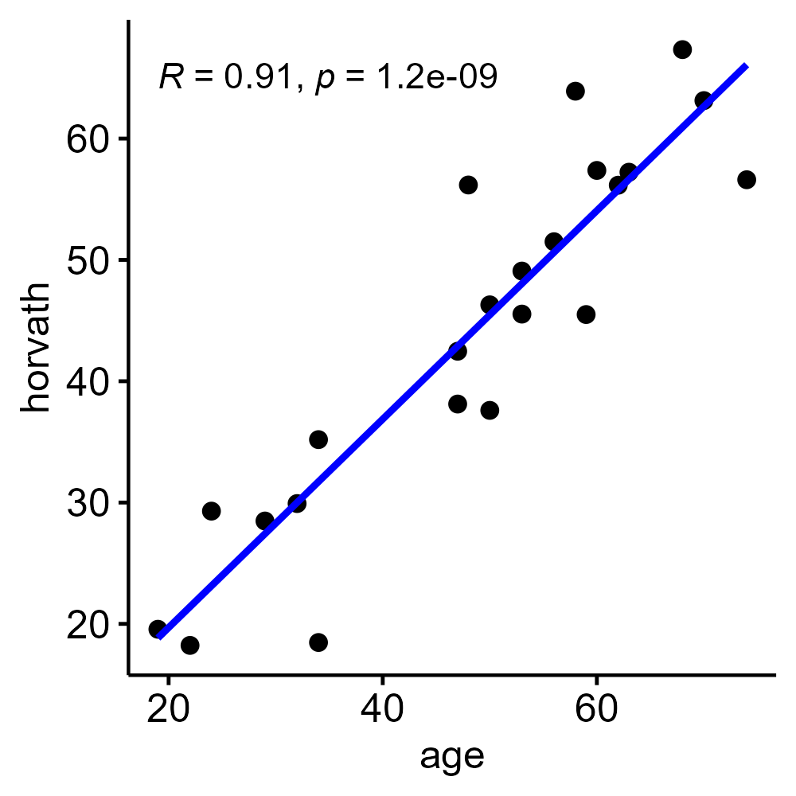
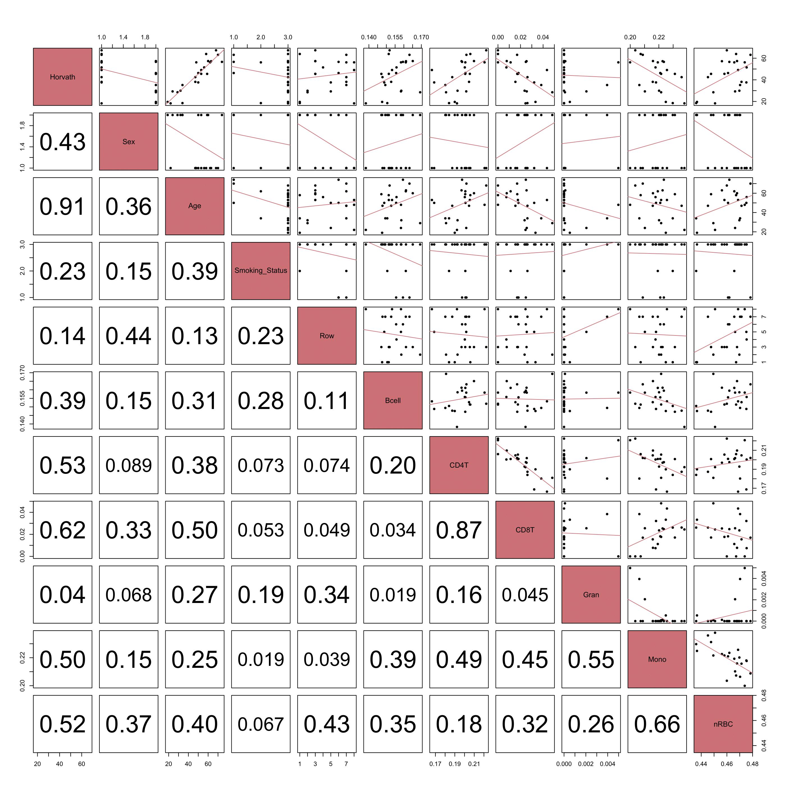

# Summary

Epigenetic age is a biological age estimation that is based off nuclear DNA methylation patterns. Specifically, the methylation of cysteine nucleotides at CpG sites. The methylation of these sites allows for alterations in gene expression without directly changing the underlying DNA sequence. As an individual ages, methylation sites change in a predictable manner, allowing for the creation of so-called epigenetic age clocks.\
\
Over the years, various epigenetic age clocks have been developed, with the majority of their differences being in the CpG sites used to estimate age. This allows for different measures of epigenetic age to be better calibrated for certain cell samples and tissue types, optimizing the accuracy and relevance of the age estimation for specific research and clinical applications.

# Statement of Need

EpigeneticAgePipeline is a comprehensive R package that aims to provide a straightforward, out-of-the-box solution for estimating a variety of epigenetic age measures, epigenetic age acceleration measures, cell count markers, as well as performing various statistical analyses. The package also generates a variety visualizations to further help understand relationships between epigenetic age markers and other biological, environmental, or clinical variables.

The measurement of epigenetic age is increasingly recognized for its profound utility in aging research, offering insights into biological aging processes distinct from chronological age. Such measures can predict the risk of age-related diseases, evaluate the impact of lifestyle factors on aging, and assess the efficacy of anti-aging interventions [@HorvathRaj2018]. EpigeneticAgePipeline addresses the challenges technical challenges of using epigenetic age in a study, by simplifying the process of both generating epigenetic age measures and utilizing statistical methods.

# Figures

{width="500"}

{width="700"}

# References
